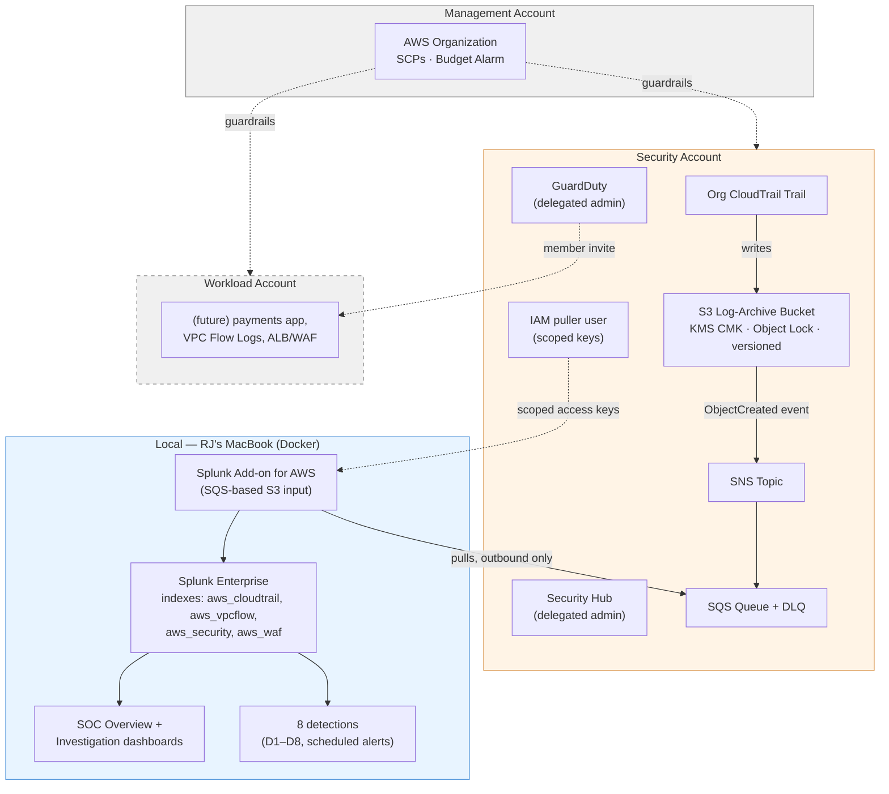
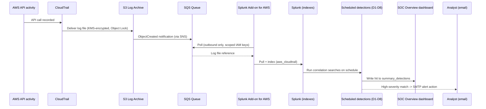

# AWS + Splunk Security Lab — "Meridian Pay" SOC Build

A senior-level, business-anchored home lab that doubles as exam prep for **AWS Certified Security – Specialty (SCS-C02)** and **Splunk Core Certified User / Power User**.

You are the founding security engineer for **Meridian Pay**, a fictional mid-size fintech running a payments API on AWS. Meridian is pursuing **PCI-DSS** and **SOC 2 Type II**. The job: stand up a cloud-native detection & response capability with Splunk as the SIEM, prove real attack patterns get detected, and produce audit-ready evidence.

Every component maps to a business driver (compliance, fraud, availability, insider risk) *and* an exam objective. That's what makes this a portfolio piece, not a tutorial.

## Status: Phase 0–1 + Phase 3 (Pattern A) + Phase 4 proven live on real AWS · currently torn down between sessions

This isn't a paper design — the Terraform in this repo has been applied to real AWS accounts, and the fixes below were only discoverable by doing that. The table below reflects what has been **proven live at least once**; see [Lab lifecycle](#lab-lifecycle-build-demonstrate-tear-down) for what's actually running right now.

| Phase | What | Status |
|---|---|---|
| 0 — Foundations | AWS Organization (3 accounts), Terraform backend, SCPs, budget alarm, SSM-only admin | ✅ Live |
| 1 — Centralized logging | Org CloudTrail, GuardDuty, Security Hub, KMS-encrypted Object-Lock S3 log archive | ✅ Live (AWS Config intentionally off — see below) |
| 2 — Splunk | Splunk Enterprise, indexes, HEC | ✅ Running locally in Docker (not the EC2/ALB design — see [Deviations](#deviations-from-the-original-design)) |
| 3 — Ingestion | Pattern A: S3 → SNS → SQS → Splunk Add-on for AWS | ✅ Terraform live; Splunk-side TA install is a manual step (`splunk/phase3-pattern-a-setup.md`) |
| 3 — Ingestion | Pattern B: EventBridge → Firehose → HEC | ⏸ Deferred (Firehose can't push to a local Docker container) |
| 4 — Detections & dashboards | 8 correlation searches as scheduled alerts, SOC Overview + investigation dashboards | ✅ Deployed to the local Splunk container |
| 5 — Attack simulation | Trigger each detection, build the efficacy table | ⏳ Not started |
| 6 — Automated response | EventBridge → Lambda auto-containment | ⏳ Not started |
| 7 — Audit evidence & write-up | Runbooks, evidence pack, exam-mapping traceability | ⏳ Not started |

## Architecture



**Why a laptop-based Splunk instead of the original EC2/ALB design?** RJ already had Splunk Enterprise running locally in Docker. Rather than stand up redundant infrastructure, the ingestion path was adapted: Pattern A (S3 → SNS → SQS) works fine with a laptop puller making outbound-only AWS API calls — no inbound reachability needed. Pattern B (EventBridge → Firehose → HEC) *can't* work this way, since Firehose has to push to Splunk, and a laptop has no stable public endpoint. See [Deviations](#deviations-from-the-original-design) for the full reasoning and what the production-shaped alternative would look like.

## Detection pipeline



## Lab lifecycle: build, demonstrate, tear down

This lab is deliberately **not** left running 24/7 — it's rebuilt on demand from Terraform, exercised, evidenced with screenshots/recordings, then the actively-billing pieces are torn down to keep cost near zero between sessions.

| State | What's live | Approx. cost |
|---|---|---|
| Built (demo) | Everything in the architecture diagram above | ~$1–4/day (GuardDuty-dominated) |
| Torn down (idle) | S3 log-archive bucket + KMS key (Object Lock, encrypted), IAM/SSM roles, budget alarm, `deny_leave_region` SCP | Pennies/month |

Torn down between sessions: SQS/SNS ingestion pipeline, Security Hub, GuardDuty (detector + delegated admin), the org CloudTrail trail, and the `deny_disable_guardduty`/`deny_disable_cloudtrail` SCP attachments (temporarily detached so Terraform could remove the resources they protect). **Never torn down**: the log-archive bucket, its KMS CMK, versioning, Object Lock, and public-access block — audit log data and its protections are preserved intentionally, per this repo's rule against weakening encryption/retention/audit logging even for cost savings. Re-running `terraform apply` recreates every torn-down resource, including reattaching both SCPs.

## Screenshots & recordings

Visual evidence of the lab running lives in [`docs/screenshots/`](docs/screenshots/):

| File | Shows |
|---|---|
| [`aws-cloudtrail-event-history.png`](docs/screenshots/aws-cloudtrail-event-history.png) | AWS Console CloudTrail Event history — real management events (root login, Config, IoT) captured by the org trail |
| [`aws-cloudwatch-config-metric.png`](docs/screenshots/aws-cloudwatch-config-metric.png) | CloudWatch metric tracking AWS Config's `ConfigurationRecorderInsufficientPermissionsFailure` — evidence for the documented Config/Object-Lock limitation above |
| [`splunk-addon-s3-inputs-health.png`](docs/screenshots/splunk-addon-s3-inputs-health.png) | Splunk Add-on for AWS health check — SQS-based S3 input throughput and indexing lag, proving Pattern A ingestion is live |
| _(added by RJ)_ | Splunk SOC Overview dashboard |
| _(added by RJ)_ | Detection alert firing (D1–D8) end to end |

> Two additional screenshots (raw CloudTrail event JSON, a search showing IAM access key IDs) were captured but excluded — they contained real AWS account IDs and access key IDs embedded throughout the content, not just in croppable chrome. Screenshots 1–3 above were reviewed and cropped to remove account ID/username before committing.

## What this lab demonstrates

| Business need | Lab capability | Cert coverage |
|---|---|---|
| Prove control effectiveness to auditors | Centralized logging + retention + dashboards | SCS Domain 2, Splunk reports/dashboards |
| Detect account compromise / fraud | Correlation searches on CloudTrail + GuardDuty | SCS Domain 1, Splunk SPL |
| Contain incidents fast | EventBridge → Lambda automated response (Phase 6, planned) | SCS Domain 1 |
| Least-privilege access | SCPs, per-resource-scoped IAM, no wildcard escalation paths | SCS Domain 3 & 4 |
| Protect cardholder data | KMS, S3 encryption, Object Lock, secrets kept out of git | SCS Domain 5 |

## The 8 detections (Phase 4)

All defined in `docs/DETECTIONS.md` with full SPL, deployed as scheduled Splunk alerts in `splunk/apps/aws_security_lab/`:

| ID | Detection | ATT&CK | Data source | Status |
|---|---|---|---|---|
| D1 | Root account usage | T1078.004 | CloudTrail | Live, email-routed |
| D2 | Console login without MFA | T1078 | CloudTrail | Live |
| D3 | IAM privilege escalation activity | T1098, T1548 | CloudTrail | Live |
| D4 | CloudTrail tampering (defense evasion) | T1562.001 | CloudTrail | Live, email-routed, highest priority |
| D5 | GuardDuty high-severity finding | varies | GuardDuty (via `aws_security`) | Configured, awaiting Pattern B |
| D6 | API activity from an unusual region | T1535 | CloudTrail | Live |
| D7 | S3 bucket made public | T1530 | CloudTrail | Live, email-routed |
| D8 | Potential data exfiltration signal | T1537, T1567 | VPC Flow Logs | Configured, awaiting VPC Flow Log delivery |

Every alert writes to a `summary_detections` index feeding the SOC Overview dashboard's detection-hit timeline. High-severity alerts (D1, D4, D5, D7) route to email via Splunk's built-in SMTP alert action — not AWS SNS, since Splunk runs locally (see Deviations).

## Repo layout

```
.
├── README.md                      # you are here
├── docs/
│   ├── ARCHITECTURE.md            # senior-level design: diagram, data flows, decisions
│   ├── PLAN.md                    # phased build plan with exit criteria, checked off as completed
│   ├── DETECTIONS.md              # detection use-cases + SPL + ATT&CK mapping
│   └── EXAM-MAPPING.md            # traceability: lab task -> exam objective
├── terraform/
│   ├── bootstrap/                 # one-time: state bucket, lock table, GitHub OIDC roles
│   ├── modules/
│   │   ├── org-baseline/          # SCPs, budget alarm, SSM-only IAM
│   │   ├── logging/                # KMS CMK, Object-Lock S3, CloudTrail, GuardDuty, Security Hub
│   │   └── ingestion-sqs/         # Phase 3 Pattern A: SNS -> SQS -> IAM puller user
│   └── main.tf                    # root module wiring everything together
├── splunk/
│   ├── apps/aws_security_lab/     # Phase 4: 8 detections, dashboards, summary index
│   ├── phase3-pattern-a-setup.md  # manual steps: install the Splunk Add-on for AWS
│   └── phase4-detections-setup.md # manual steps: deploy the detections app, configure email
└── runbooks/                      # incident response runbooks (Phase 7)
```

## How to use it

Work the phases in `docs/PLAN.md` in order — later detections depend on earlier data sources being live. Each phase has a definition of done and a cost checkpoint.

To reproduce the live AWS infrastructure:
1. `cd terraform/bootstrap && terraform apply` with real AWS credentials — creates the state bucket, lock table, and GitHub OIDC roles.
2. Copy the outputs into `terraform/provider.tf`'s backend block and set `security_role_arn` in `terraform.tfvars` (see the two-mode explanation in `terraform/README.md` — ambient credentials are usually management-account, so the default provider needs to assume into the security account).
3. Fill in `terraform/terraform.tfvars` from `terraform.tfvars.example`.
4. `cd terraform && terraform apply`.

To reproduce the Splunk side: follow `splunk/phase3-pattern-a-setup.md` (ingestion) and `splunk/phase4-detections-setup.md` (detections + dashboards).

> **Cost note:** GuardDuty (~$1–4/day depending on CloudTrail volume) is the main recurring line item; everything else (S3, SQS/SNS, KMS) is pennies. There is no EC2 instance running — Splunk is local — so the usual "stop the instance" teardown step doesn't apply here. AWS Config is deliberately disabled (see below), so it costs nothing.

## Deviations from the original design

Documented here rather than hidden, because *why* a real build diverges from its spec is the more interesting engineering story:

- **Splunk runs locally in Docker, not on EC2 behind an internal ALB.** The original design (`docs/ARCHITECTURE.md`) calls for Splunk on a private-subnet EC2 instance with SSM-only access. RJ already had a Splunk container running locally with existing credentials — building a redundant EC2 instance would have been wasted effort for a personal lab. The EC2 build is deferred, not abandoned: it's the right move before Phase 5 (attack simulation) needs a cloud-reachable target, or before this becomes a production-shaped reference architecture.
- **Only ingestion Pattern A is live.** Pattern B (EventBridge → Firehose → HEC) requires AWS to push events to Splunk's HEC endpoint — impossible for a laptop with no public IP or stable endpoint, short of a tunnel (ngrok/Cloudflare Tunnel). Pattern A works because the Splunk Add-on for AWS polls SQS outbound-only, no inbound reachability needed. Consequence: `aws_security` (GuardDuty/Security Hub findings) and `aws_vpcflow` won't have real data until Pattern B or VPC Flow Logs exist.
- **AWS Config is disabled** (`enable_aws_config = false`, off by default). This isn't a workaround — it's a real, documented AWS limitation: Config's `PutDeliveryChannel` does not support S3 buckets with Object Lock and default retention enabled, and the log-archive bucket has that intentionally for CloudTrail tamper-evidence (a PCI/SOC 2 requirement). The fix is a second, non-Object-Lock bucket dedicated to Config — tracked as future work, not built yet.
- **High-severity alerts route through Splunk's email action, not AWS SNS.** The original design assumes Splunk can reach AWS services directly for response actions. Locally, the simpler and equally valid path is Splunk's own SMTP-based email alerting.

None of these change the security posture of what *is* live — SCPs, least-privilege IAM, KMS encryption, Object Lock, and Block Public Access are all real and enforced on real AWS resources, verified by a multi-round sentinel security review (see below) before every apply.

## Real bugs found by applying to real AWS

Validated-but-unapplied Terraform hides bugs that only surface against the real service. Three worth calling out, because they're the kind of thing that separates "it plans clean" from "it actually works":

1. **AWS Config's S3 key prefix can't contain `AWSLogs/`** — that prefix is reserved for CloudTrail. `InvalidS3KeyPrefixException` on the first real apply attempt.
2. **The log-archive bucket uses `ObjectOwnership = BucketOwnerEnforced`** (the modern S3 default), which disables ACLs entirely. Several bucket-policy statements conditioned on `s3:x-amz-acl = bucket-owner-full-control` — a condition that can never be satisfied when ACLs are off, silently breaking the Allow statement for every caller. This is the kind of bug that "looks correct" in a code review and only shows up as a mysterious `AccessDenied` against live infrastructure.
3. **AWS Config fundamentally can't deliver to an Object-Lock bucket at all** — not a permissions problem, a hard product limitation. Five rounds of increasingly precise IAM/bucket-policy fixes (`kms:Decrypt`, `s3:ListBucket` bucket-existence-check permission, `aws:SourceAccount` conditions) all failed identically before a web search surfaced the actual documented constraint. The fix was architectural (disable Config, flag it for a follow-up), not another permission tweak.

Every fix went through a builder → sentinel security-review loop before touching real infrastructure again — see the commit history and `docs/PLAN.md` for the pattern.

## Security review discipline

Every Terraform change to IAM, KMS key policies, or S3 bucket policies in this repo was reviewed by a dedicated security-review pass before being applied, chasing findings to full closure across multiple rounds rather than accepting "mostly fixed." Examples of what that caught:
- An IAM privilege-escalation path via `PutRolePolicy` + `PassRole` that would have let CI's apply role grant itself admin.
- An overly broad cross-account `AssumeRole` grant into an account with no resources yet (removed, to be re-added only alongside its first real consumer).
- Missing `aws:SourceAccount` scoping on service-principal bucket-policy statements that would have allowed *any* AWS account's Config/log-delivery service to target this bucket, not just this one.

Full detail on the review pattern and findings is in `docs/PLAN.md` and the commit history.
